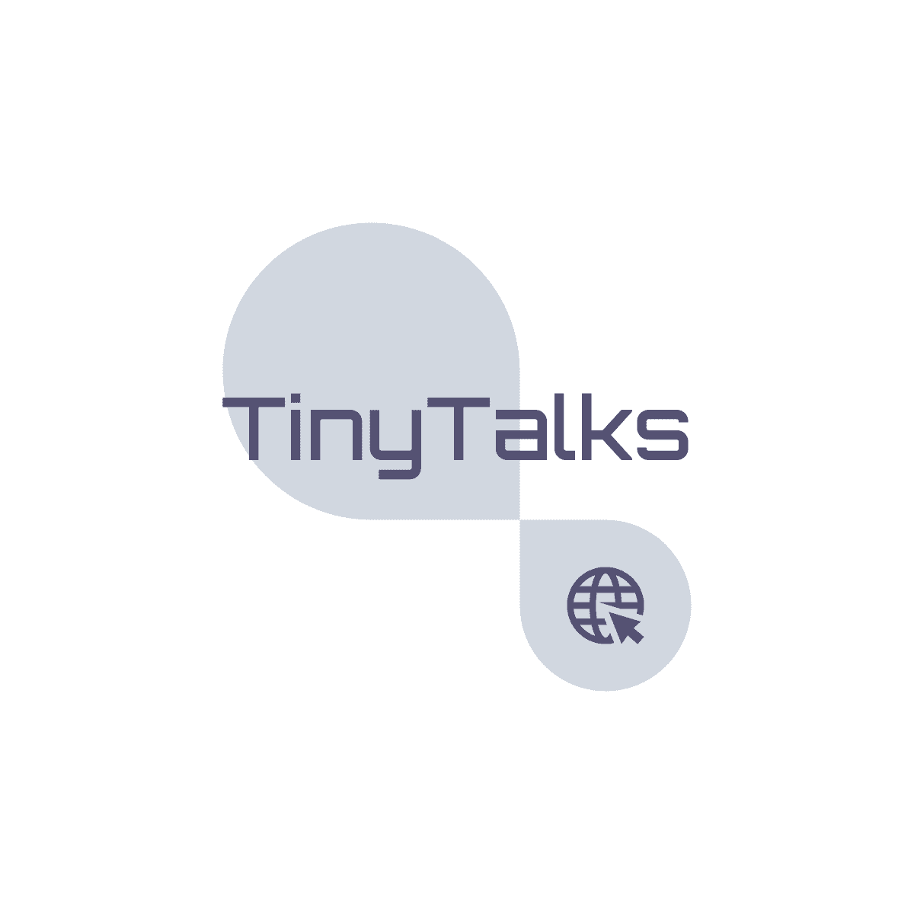

<h2 align="center"> 🔬TinyTalks: A Community for NLP research in Short Text in Chinese</h2>

<h4 align="center">
    <a href="https://github.com/DBsCCorpus">中文</a> |
    <a href="https://github.com/DBsCCorpus">English</a>
</h4>

🙋‍♀️ This is **TinyTalks**: A Community for NLP research in Short Text in Chinese

🦋 **Butterfly** is the project we focus on currently, which is An Open NLP Research Project for Chinese Danmaku. You can see the details in https://github.com/TinyTalks/Butterfly

👩‍💻 If you are interested in our work and want to join us, we are very welcome. Please contact with us.
<!--

**Here are some ideas to get you started:**

🙋‍♀️ This is TinyTalks: A Community for NLP research in Short Text in Chinese
🌈 Contribution guidelines - how can the community get involved?
👩‍💻 Useful resources - where can the community find your docs? Is there anything else the community should know?
🍿 Fun facts - what does your team eat for breakfast?
🧙 Remember, you can do mighty things with the power of [Markdown](https://docs.github.com/github/writing-on-github/getting-started-with-writing-and-formatting-on-github/basic-writing-and-formatting-syntax)
-->
